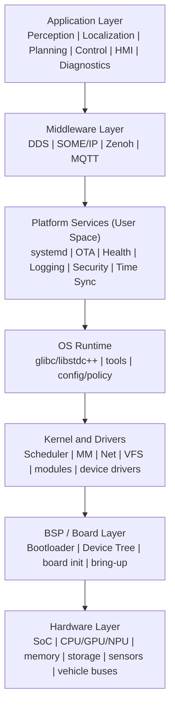
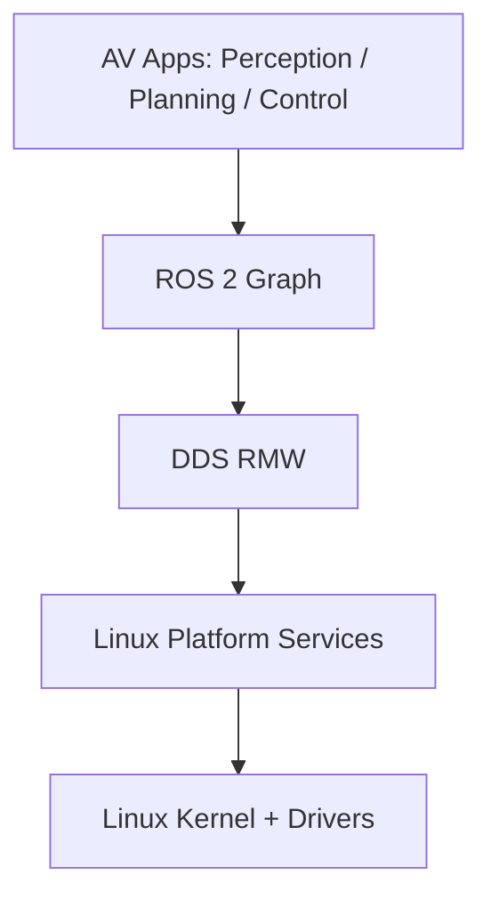
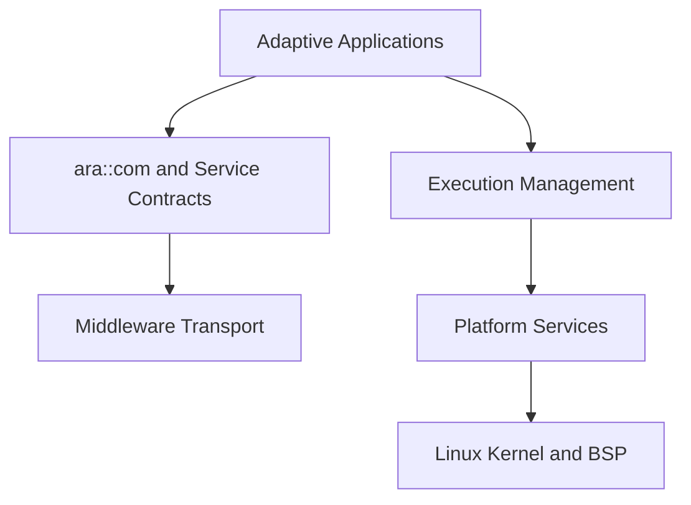
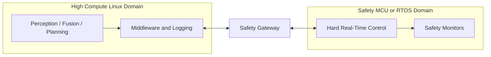
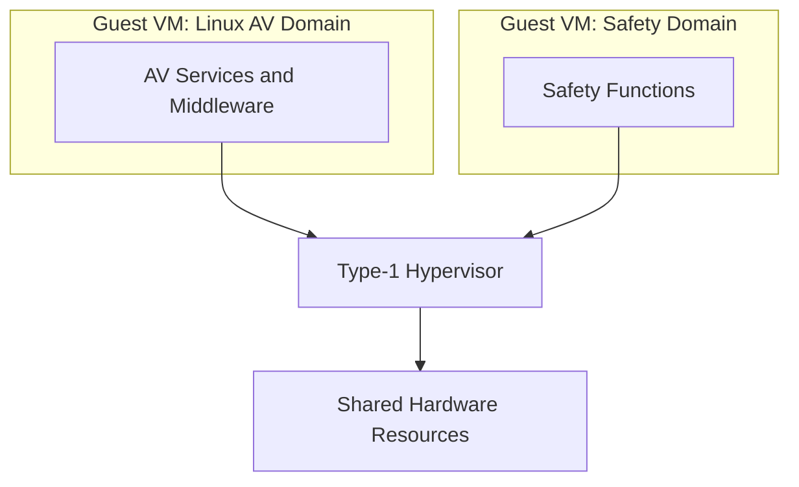
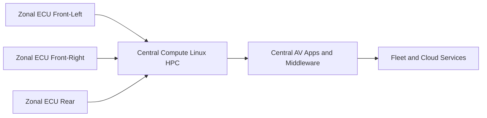
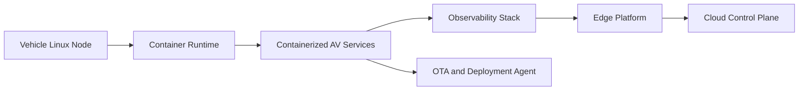

# Linux Platform Guide for Autonomous Vehicles

## Table of Contents

- [1. Purpose and Scope](#1-purpose-and-scope)
- [2. Typical AV Linux Stack](#2-typical-av-linux-stack)
- [3. Folder Structures (Embedded Linux Focus)](#3-folder-structures-embedded-linux-focus)
- [4. Linux Permissions, Ownership, and Security Basics](#4-linux-permissions-ownership-and-security-basics)
- [5. Kernel, Kernel Modules, and Drivers](#5-kernel-kernel-modules-and-drivers)
- [6. User Space and Process Lifecycle](#6-user-space-and-process-lifecycle)
- [7. systemd in AV Platforms](#7-systemd-in-av-platforms)
- [8. Logging and Observability](#8-logging-and-observability)
- [9. Communication Middleware: DDS, MQTT, Zenoh](#9-communication-middleware-dds-mqtt-zenoh)
- [10. gdb and Linux Debugging](#10-gdb-and-linux-debugging)
- [11. System Config Tools](#11-system-config-tools)
- [12. Popular Frameworks in AV Linux Platforms](#12-popular-frameworks-in-av-linux-platforms)
- [13. Startup, Health Monitoring, and Shutdown Design for AV](#13-startup-health-monitoring-and-shutdown-design-for-av)
- [14. Practical Recommendations for an AV Program](#14-practical-recommendations-for-an-av-program)
- [15. Minimal Incident Debug Playbook](#15-minimal-incident-debug-playbook)
- [16. Glossary](#16-glossary)
- [17. Conclusion](#17-conclusion)

## 1. Purpose and Scope

This document explains key Linux concepts and tooling for Autonomous Vehicle (AV) platform applications. It is written for teams building perception, planning, control, connectivity, telemetry, diagnostics, and over-the-air update features on embedded Linux.

Topics covered:
- gdb, DDS, MQTT, Zenoh ("zehoh" in your request), and Bazel ("bezel" likely intended as Bazel)
- Kernel, kernel modules, and drivers
- Folder structures and ownership/permissions
- User space and process lifecycle
- systemd, startup, shutdown, and logging
- System configuration and debugging tools
- Popular frameworks used in AV systems

## 2. Typical AV Linux Stack

A practical AV Linux software stack can be viewed in layers:

1. Hardware layer
- SoC, CPU/GPU/NPU, CAN/LIN/Ethernet PHY, CSI cameras, radar, lidar, GNSS, IMU, storage

2. Kernel layer
- Linux kernel, scheduler, memory manager, network stack, filesystem, device drivers

3. Middleware and transport
- DDS and/or Zenoh for pub/sub and service communication
- MQTT for cloud telemetry and fleet management

4. User space platform services
- systemd services, container runtime (optional), security agents, log collectors

5. AV applications
- Sensor ingestion, perception, localization, planning, controls, HMI, diagnostics

### 2.1 Layered AV Linux Architecture Diagram

```text
+-----------------------------------------------------------------------------------+
|                                AV APPLICATION LAYER                              |
|  Perception | Localization | Planning | Control | Diagnostics | HMI | Telemetry |
+-----------------------------------------------------------------------------------+
|                             MIDDLEWARE / IPC LAYER                               |
|   DDS (in-vehicle real-time) | SOME/IP | Zenoh (edge fabric) | MQTT (cloud)     |
+-----------------------------------------------------------------------------------+
|                         PLATFORM SERVICES / USER SPACE                            |
| systemd | Lifecycle mgmt | Health monitor | OTA | Logging | Security | Time sync |
+-----------------------------------------------------------------------------------+
|                           OS RUNTIME AND SYSTEM LAYER                             |
| glibc/libstdc++ | BusyBox/coreutils | Network tools | Config and policy (/etc)   |
+-----------------------------------------------------------------------------------+
|                          LINUX KERNEL AND DRIVER LAYER                            |
| Scheduler | MM | VFS | Net stack | IPC | cgroups/namespaces | Modules | Drivers  |
| Camera | LiDAR | Radar | CAN/LIN/FlexRay | GNSS/IMU | GPU/NPU | Storage | USB    |
+-----------------------------------------------------------------------------------+
|                                 BSP / BOARD LAYER                                 |
| Boot chain (HSS/U-Boot) | DT/DT overlays | Board init scripts | HW bring-up      |
+-----------------------------------------------------------------------------------+
|                               HARDWARE / SILICON LAYER                            |
| SoC | CPU | RAM | Flash/eMMC/SD | NIC/PHY | Sensors | Vehicle I/O                |
+-----------------------------------------------------------------------------------+
```



### 2.2 Common Architecture Variants

The layered diagram above is a common reference model, not a single mandatory standard.
Real AV programs usually adapt it based on safety level, compute topology, and product constraints.

| Variant | Typical shape | Best fit | Trade-offs |
|--------|----------------|----------|------------|
| ROS 2 centric Linux stack | Linux hosts most AV graph, DDS-native communication | Fast feature development and research-to-product flow | Requires strict QoS and resource governance for determinism |
| AUTOSAR Adaptive aligned | Service contracts and lifecycle driven by Adaptive concepts | Programs targeting stronger standardization and supplier interoperability | Higher integration complexity and process overhead |
| Mixed-criticality split | Linux for high compute, RTOS/MCU for hard real-time safety loops | Safety-critical products needing strict isolation | More cross-domain integration and testing effort |
| Hypervisor-separated domains | Linux and safety domain in separate partitions/VMs | Strong fault containment and certification boundaries | Added platform complexity and performance overhead |
| Zonal + central compute | Zonal ECUs plus central HPC Linux nodes | Scalable vehicle architectures with domain aggregation | Networking and orchestration complexity |
| Edge-cloud native Linux | Containerized services, telemetry-first operations | Fleet-centric products with rapid update cycles | Requires mature DevOps/SRE practices and observability |

#### Variant Architecture Diagrams

ROS 2 centric Linux stack:



AUTOSAR Adaptive aligned:



Mixed-criticality split:



Hypervisor-separated domains:



Zonal + central compute:



Edge-cloud native Linux:



### 2.3 Reading References for Linux AV Architecture

- Linux kernel documentation: https://docs.kernel.org/
- Buildroot manual: https://buildroot.org/docs.html
- Yocto Project documentation: https://docs.yoctoproject.org/
- AUTOSAR Adaptive Platform: https://www.autosar.org/standards/adaptive-platform/
- SOAFEE: https://soafee.io/
- Eclipse SDV: https://sdv.eclipse.org/
- Automotive Grade Linux (AGL): https://www.automotivelinux.org/
- ELISA project (Linux safety): https://elisa.tech/
- ROS 2 architecture and design: https://design.ros2.org/
- DDS specification (OMG): https://www.omg.org/spec/DDS/

## 3. Folder Structures (Embedded Linux Focus)

### 3.1 Root filesystem layout

Common runtime folders on target:

- /bin, /sbin: core executables
- /lib, /usr/lib: shared libraries
- /etc: configuration files
- /var: mutable runtime state and logs
- /run: volatile runtime state (tmpfs)
- /tmp: temporary files
- /home: user data
- /opt: optional vendor applications
- /srv: service data
- /proc, /sys: kernel virtual filesystems
- /dev: device nodes

### 3.2 Recommended AV project layout

Example project structure:

- platform/
- platform/kernel/              kernel config fragments, patches
- platform/drivers/             out-of-tree modules and board support
- platform/systemd/             service units and targets
- platform/config/              environment and deployment configs
- platform/scripts/             provisioning and diagnostics scripts
- middleware/dds/               DDS QoS profiles and IDL
- middleware/zenoh/             Zenoh router/client configs
- middleware/mqtt/              MQTT topic and broker configs
- apps/perception/
- apps/localization/
- apps/planning/
- apps/control/
- apps/telemetry/
- tools/debug/
- docs/

### 3.3 Buildroot-style project references

In a Buildroot-based project:
- package/: package recipes and integration rules
- board/: board-specific files (boot scripts, overlays, image configs)
- configs/: product and board defconfigs
- output/: generated host tools, target rootfs, and images

## 4. Linux Permissions, Ownership, and Security Basics

### 4.1 Permissions model

Linux uses user/group/other bits:
- r (read), w (write), x (execute)

Examples:
- 755: owner rwx, group rx, others rx
- 644: owner rw, group r, others r
- 600: owner rw only

### 4.2 Ownership best practices for AV

- Run long-lived services as dedicated non-root users
- Restrict write access to config and binaries
- Use groups for hardware access, for example camera, gpio, can, dialout
- Keep private credentials at 600 with dedicated service owner

### 4.3 Capability and hardening ideas

- Use Linux capabilities instead of full root where possible
- Enable read-only root filesystem where feasible
- Apply seccomp/AppArmor/SELinux policy in production
- Separate safety-critical and non-critical services

## 5. Kernel, Kernel Modules, and Drivers

### 5.1 Kernel role in AV

The kernel provides:
- Deterministic scheduling behavior (especially with PREEMPT_RT)
- Memory and process isolation
- Networking (Ethernet, TSN, CAN, SOME/IP support via user libraries)
- Hardware abstractions through drivers

### 5.2 Kernel modules

Kernel modules are loadable components used for:
- Device drivers
- Filesystem support
- Networking extensions

Useful commands:
- lsmod: list loaded modules
- modinfo <module>: metadata
- modprobe <module>: load module and dependencies
- rmmod <module>: remove module

### 5.3 Driver categories in AV

- Sensor drivers: camera, lidar, radar, IMU
- Vehicle bus drivers: CAN, LIN, FlexRay interfaces
- Storage and filesystem drivers
- GPU/NPU accelerators
- Networking and TSN-capable interfaces

### 5.4 In-tree vs out-of-tree drivers

- In-tree drivers are maintained inside kernel source and are preferred long-term
- Out-of-tree drivers are faster to start with but increase maintenance burden

## 6. User Space and Process Lifecycle

### 6.1 User space responsibilities

User space hosts:
- Middleware (DDS/Zenoh/MQTT clients and routers)
- AV algorithms and orchestration
- Logging, health monitoring, and update agents

### 6.2 Process lifecycle

Typical process states:
- Created (fork/exec)
- Running
- Sleeping or waiting (I/O, timers, IPC)
- Stopped (signal)
- Zombie (exited, waiting for parent reap)

Key lifecycle operations:
- Start: systemd starts unit when dependencies are met
- Supervision: restart policies recover from crashes
- Stop: SIGTERM then SIGKILL after timeout
- Recovery: watchdog and health checks trigger restart/failover

## 7. systemd in AV Platforms

### 7.1 Why systemd matters

systemd provides:
- Service dependency ordering
- Restart policies and watchdog integration
- Isolation features (namespaces, resource controls)
- Unified logging via journald

### 7.2 Typical service patterns

- One service per core component (sensor manager, fusion node, planner, control)
- Explicit After and Requires dependencies
- Restart set to on-failure for resilient components
- Health check endpoints combined with WatchdogSec

### 7.3 Example startup dependency strategy

1. Basic OS target reaches network and storage readiness
2. Hardware bring-up services initialize buses and sensors
3. Middleware routers and brokers start (DDS/Zenoh/MQTT)
4. AV application graph starts in dependency order
5. Monitoring and telemetry services start

### 7.4 Startup and shutdown flow

Startup:
- firmware/bootloader -> kernel -> initramfs (optional) -> systemd init -> targets -> services

Shutdown:
- systemd stops services in reverse dependency order
- applications flush state and logs
- filesystems sync and unmount
- kernel powers off or reboots

## 8. Logging and Observability

### 8.1 Logging pipeline

Typical AV logging path:
- app logs -> journald -> local persistent storage -> optional remote upload

### 8.2 Tooling

- journalctl: inspect systemd logs
- dmesg: kernel ring buffer logs
- rsyslog/fluent-bit/vector: forwarding and aggregation
- perf/ftrace/eBPF: performance and trace instrumentation

### 8.3 Logging best practices for AV

- Use structured logs (JSON or key=value)
- Include timestamp, ECU ID, trip/session ID, and component name
- Rate-limit repetitive errors
- Separate safety-critical event logs from verbose debug logs

## 9. Communication Middleware: DDS, MQTT, Zenoh

### 9.1 DDS

DDS is common for real-time robotic and AV internal communication.

Where it fits:
- In-vehicle low-latency pub/sub between perception, localization, planning, and control

Strengths:
- Strong QoS model (reliability, durability, deadlines, liveliness)
- Data-centric discovery and typed interfaces (IDL)

Considerations:
- QoS mismatch can cause silent communication failures
- Needs careful tuning for CPU and memory on embedded targets

### 9.2 MQTT

MQTT is best for lightweight telemetry and cloud connectivity.

Where it fits:
- Vehicle-to-cloud telemetry, health metrics, command/control, OTA status

Strengths:
- Lightweight protocol and broad ecosystem
- Broker-centric model suitable for fleet backends

Considerations:
- Not usually the primary real-time in-vehicle bus for control loops
- Secure with TLS, client certs, and strict topic ACLs

### 9.3 Zenoh (zehoh)

Zenoh is used for efficient data distribution across edge and cloud domains.

Where it fits:
- Bridging in-vehicle compute, edge nodes, and cloud with pub/sub, query, and storage integration

Strengths:
- Efficient across constrained and high-performance networks
- Can bridge different data domains and topologies

Considerations:
- Plan discovery and routing topology carefully
- Validate latency and reliability under packet loss scenarios

### 9.4 DDS vs MQTT vs Zenoh quick guide

- DDS: real-time in-vehicle data exchange
- MQTT: cloud telemetry and remote operations
- Zenoh: edge-cloud data fabric and distributed query/pub-sub bridging

## 10. gdb and Linux Debugging

### 10.1 gdb use in AV

gdb is used to debug crashes, logic errors, and thread issues in C/C++ components.

Common workflows:
- Attach to running process for live diagnostics
- Analyze core dumps post-crash
- Remote debug target from development host with gdbserver

### 10.2 Core dump and symbol strategy

- Build with debug symbols for development variants
- Enable and collect core dumps in controlled environments
- Preserve exact binaries and symbols per release build

### 10.3 Complementary debug tools

- strace: syscall tracing
- ltrace: user library call tracing
- gdbserver: remote target debugging
- valgrind: memory issue detection (where performance overhead is acceptable)
- perf: CPU profiling and hotspots
- ftrace/eBPF: low overhead tracing in production-like runs

## 11. System Config Tools

Useful Linux/system tools:
- sysctl: kernel runtime parameters
- udevadm: device event and rule diagnostics
- ip, ss, ethtool: network and socket inspection
- nmcli/systemd-networkd tools: network configuration
- timedatectl: time synchronization settings
- hwclock: RTC management
- systemctl: service control and state
- loginctl: session and user manager data

Build and deployment tools frequently used:
- Buildroot/Yocto: embedded distro generation
- Bazel (bezel): large-scale builds and reproducibility for app stacks
- CMake/Meson: native builds for middleware and apps

## 12. Popular Frameworks in AV Linux Platforms

Commonly used frameworks and platforms:
- ROS 2 (often with DDS): robotics and modular graph execution
- Autoware: open-source autonomous driving stack
- OpenCV: vision pipelines
- GStreamer: camera and media pipelines
- TensorRT/OpenVINO/ONNX Runtime: accelerated inference
- SOME/IP stacks and CAN libraries: vehicle networking

Selection guidance:
- Use ROS 2 or equivalent for modularity and tooling
- Use DDS QoS profiles for deterministic internal communication
- Use MQTT/Zenoh bridges for fleet and edge integration

## 13. Startup, Health Monitoring, and Shutdown Design for AV

### 13.1 Startup checklist

1. Validate hardware readiness (sensors, bus links, clocks)
2. Start middleware services (DDS participants, Zenoh router, MQTT client)
3. Start safety monitors before motion-related services
4. Start perception/localization/planning/control pipeline
5. Enable mission mode only after health checks pass

### 13.2 Runtime health model

- Heartbeats from each critical component
- Watchdog supervision and restart policies
- Graceful degradation mode on component failure
- Immediate safe-state transition for critical faults

### 13.3 Shutdown checklist

1. Stop motion/control commands first
2. Flush telemetry and event logs
3. Persist critical state and diagnostics snapshot
4. Stop middleware and app services in reverse dependency order
5. Sync filesystems and power down safely

## 14. Practical Recommendations for an AV Program

- Define clear service boundaries and one owner per service
- Version all middleware interface definitions (IDL/messages/topics)
- Maintain separate debug and production build profiles
- Run fault-injection tests for startup, runtime, and shutdown paths
- Track boot-time budget and enforce it in CI
- Keep a reproducible artifact chain: source, config, binaries, symbols, SBOM

## 15. Minimal Incident Debug Playbook

When a vehicle-side Linux issue occurs:

1. Collect context
- systemd status, recent journal, dmesg, process list, CPU/memory snapshots

2. Triage quickly
- Is this hardware, driver, middleware, or app level?

3. Preserve evidence
- Core dumps, exact binaries/symbols, config files, timeline of events

4. Reproduce and isolate
- Re-run with extra tracing, reduced workload, and deterministic inputs

5. Fix and harden
- Add service guards, retries, resource limits, and telemetry alerts

## 16. Glossary

- AV: Autonomous Vehicle
- DDS: Data Distribution Service
- MQTT: Message Queuing Telemetry Transport
- Zenoh: Data-centric protocol and software stack for edge-to-cloud systems
- Bazel: Build and test tool for large multi-language codebases
- QoS: Quality of Service
- ECU: Electronic Control Unit

## 17. Conclusion

For AV platforms, Linux is strongest when treated as a full system, not just an OS kernel. Reliable production behavior depends on the right combination of kernel and driver maturity, strict process supervision with systemd, disciplined middleware choices (DDS/MQTT/Zenoh), strong logging and debug practices, and well-defined startup and shutdown safety flows.
