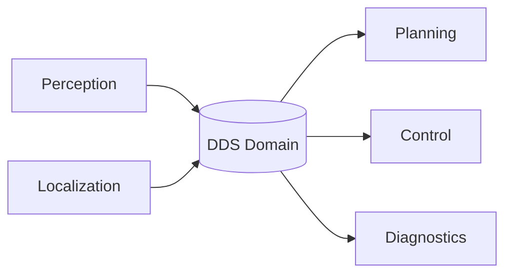
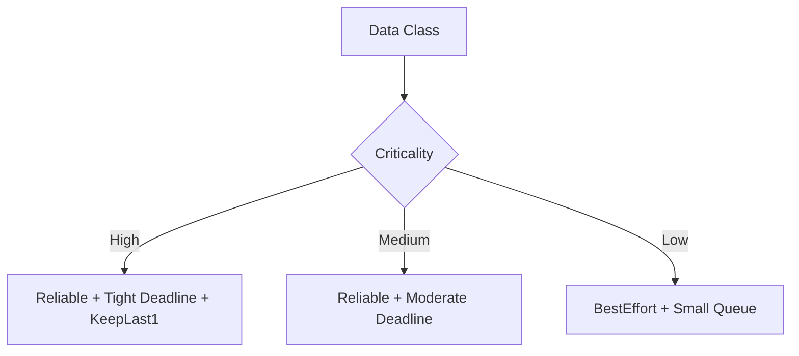

# DDS Deep Dive for Autonomous Vehicle Platforms

## Table of Contents

- [1. Purpose](#1-purpose)
- [2. Where DDS Fits](#2-where-dds-fits)
- [3. Core DDS Components](#3-core-dds-components)
- [4. QoS Design for AV Workloads](#4-qos-design-for-av-workloads)
- [5. Security Model](#5-security-model)
- [6. Development Workflow](#6-development-workflow)
- [7. Monitoring and Operations](#7-monitoring-and-operations)
- [8. Common Failure Modes](#8-common-failure-modes)
- [9. Best Practices](#9-best-practices)

## 1. Purpose

This document explains how to design, implement, monitor, and operate DDS in embedded Linux systems for Autonomous Vehicle (AV) software.

## 2. Where DDS Fits

DDS is best suited for in-vehicle, low-latency, data-centric communication between perception, localization, planning, control, and safety services.

ASCII view:

```text
+-------------------+     +-------------------+     +-------------------+
| Perception Node   | --> | Localization Node | --> | Planning Node     |
| (Publisher)       |     | (Pub/Sub)         |     | (Subscriber)      |
+-------------------+     +-------------------+     +-------------------+
          \                         |                          /
           \                        |                         /
            +-----------------------+------------------------+
                            DDS Domain (QoS-driven)
```

Mermaid view:



## 3. Core DDS Components

- DomainParticipant: joins a DDS domain
- Topic: named typed data channel
- DataWriter: publishes samples to a topic
- DataReader: subscribes to a topic
- QoS Profiles: reliability, durability, deadline, liveliness, history
- Discovery: automatic endpoint discovery in-domain

## 4. QoS Design for AV Workloads

Use QoS per data class, not one global profile.

Example QoS mapping:

- Raw sensor stream:
  - reliability: best-effort
  - history: keep-last small depth
  - deadline: tight

- Fused state estimate:
  - reliability: reliable
  - deadline: strict
  - liveliness: automatic with short lease

- Control command path:
  - reliability: reliable
  - durability: volatile
  - history: keep-last 1
  - deadline: very strict

Mermaid for QoS classes:



## 5. Security Model

Recommended DDS security baseline:
- Mutual authentication between participants
- Encrypted transport for sensitive topics
- Topic-level permission policy
- Certificate lifecycle and rotation process

## 6. Development Workflow

1. Define message contracts and ownership
2. Assign QoS profile per topic
3. Implement publishers and subscribers
4. Run compatibility and latency tests
5. Perform packet-loss and restart fault injection
6. Qualify on target hardware under load

## 7. Monitoring and Operations

Track at minimum:
- publish and subscribe rates
- end-to-end latency percentiles
- sample drop counts
- discovery convergence time
- participant reconnect events

Use:
- structured logs with topic and frame IDs
- metrics exporters feeding Prometheus and Grafana
- alerting on sustained deadline misses

## 8. Common Failure Modes

- QoS mismatch causing silent non-communication
- Overly deep queues increasing stale data
- Discovery instability on segmented networks
- CPU spikes from excessive reliable traffic

Quick triage sequence:
1. Verify endpoint discovery
2. Compare QoS compatibility
3. Inspect queue depth and drop metrics
4. Validate time sync quality and network loss

## 9. Best Practices

- Define QoS profiles in version-controlled files
- Keep critical control topics minimal and deterministic
- Separate high-rate sensor traffic from low-rate diagnostics
- Enforce schema compatibility checks in CI
- Treat DDS config changes like code changes with review and rollback
