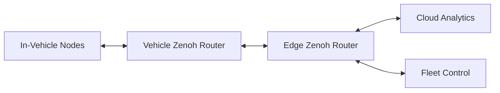
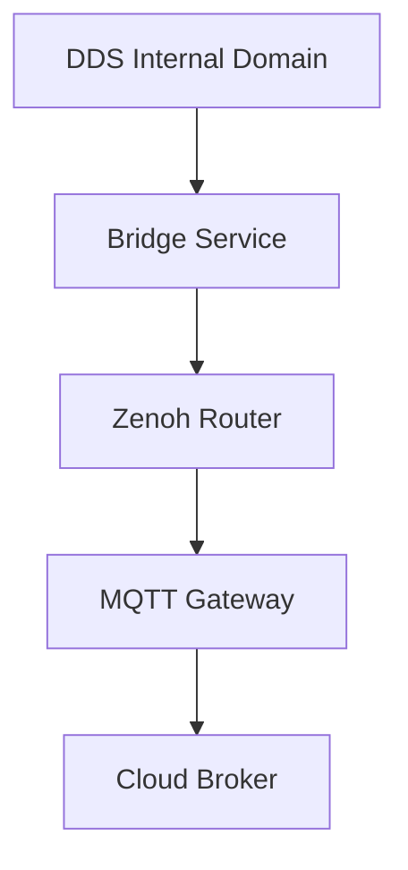

# Zenoh Deep Dive for Autonomous Vehicle Platforms

## Table of Contents

- [1. Purpose](#1-purpose)
- [2. Where Zenoh Fits](#2-where-zenoh-fits)
- [3. Core Zenoh Components](#3-core-zenoh-components)
- [4. Data Flow Patterns](#4-data-flow-patterns)
- [5. Integration with DDS and MQTT](#5-integration-with-dds-and-mqtt)
- [6. Security Model](#6-security-model)
- [7. Development Workflow](#7-development-workflow)
- [8. Monitoring and Operations](#8-monitoring-and-operations)
- [9. Common Failure Modes](#9-common-failure-modes)
- [10. Best Practices](#10-best-practices)

## 1. Purpose

This document explains how Zenoh can be used in AV Linux systems as a flexible edge-to-cloud data fabric for publish-subscribe, query, and distributed data access.

## 2. Where Zenoh Fits

Zenoh is useful when data must move efficiently between vehicle compute nodes, edge infrastructure, and cloud services with mixed network quality.

ASCII view:

```text
[In-Vehicle Compute] <--> [Zenoh Router at Vehicle Gateway] <--> [Edge Router] <--> [Cloud Services]
         |                            |
         +---- local pub/sub ---------+---- query/reply and selective forwarding
```

Mermaid view:



## 3. Core Zenoh Components

- Session: endpoint context for communication
- Key expression space: hierarchical naming for data
- Publisher and subscriber APIs
- Query and queryable APIs for request style interaction
- Router components for distribution and forwarding

## 4. Data Flow Patterns

Common patterns:
- local in-vehicle pub/sub for non-hard-real-time distribution
- selective edge forwarding for compressed summaries
- query/reply for diagnostics and on-demand snapshots
- optional storage integration for historical lookups

## 5. Integration with DDS and MQTT

A practical AV pattern:
- DDS for real-time in-vehicle critical data paths
- Zenoh for cross-domain bridging and selective dissemination
- MQTT for cloud telemetry and fleet command control

Mermaid bridge model:



## 6. Security Model

Security baseline:
- authenticated sessions and peer identity
- encrypted transport across untrusted links
- key-expression authorization policy
- credential provisioning and rotation process

## 7. Development Workflow

1. Define key expression taxonomy and ownership
2. Classify data for local, edge, or cloud visibility
3. Implement publishers, subscribers, and queryables
4. Validate routing behavior under link degradation
5. Test bridge interoperability with DDS and MQTT systems
6. Qualify throughput and latency at production-like load

## 8. Monitoring and Operations

Track:
- router session health
- forwarding throughput and drop rates
- query latency percentiles
- reconnect and route-convergence time

Operational controls:
- bounded buffers and explicit backpressure policy
- topology change audit logs
- staged rollout of router config updates

## 9. Common Failure Modes

- Key-space collisions from poor naming governance
- Misrouted data due to permissive forwarding rules
- Unexpected latency from over-broad subscriptions
- Bridge feedback loops between transport domains

## 10. Best Practices

- Use naming conventions with strict ownership
- Route only necessary data across domain boundaries
- Enforce compatibility checks for schema and bridge transforms
- Keep critical control loops off non-deterministic wide-area links
- Maintain a tested rollback plan for router configuration
